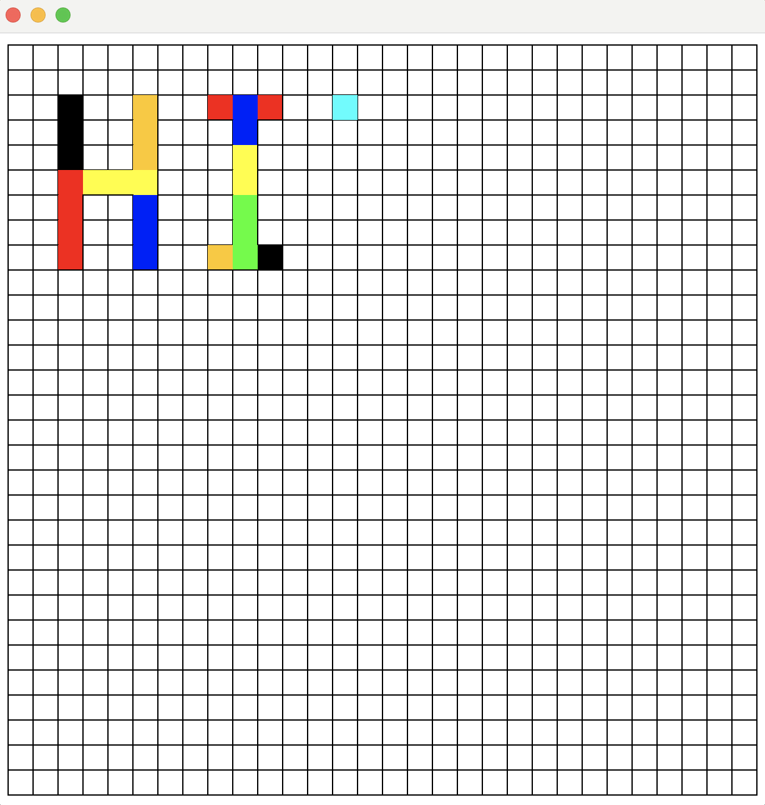

    

# 🖥️  MapEditor

The MapEditor is a project developed with Java concepts. This Java application consist in a cursor moving on a grid and painting cells in different available colours (see the commands below). This project allows practicing Java skills with a graphical component using the SimpleGraphicGfx library.

## 🚀  Tech Tools

- Java
- Git and Github

##  :video_game: Commands

- Use arrow keys to move the cursor ⬆️ ⬅️ :arrow_right: ⬇️ 
- Press 'space bar' to paint the cell in black ⬛️
- Press 'P' to paint the cell in pink 🟪
- Press 'B' to paint the cell in blue 🟦
- Press 'G' to paint the cell in green 🟩
- Press 'R' to paint the cell in red 🟥
- Press 'Y' to paint the cell in yellow 🟨
- Press 'O' to paint the cell in orange 🟧
- Press 'C' to clear the screen 🧽
- Press 'S' to save the drawing 📝
- Press 'L' to load the saved drawing :leftwards_arrow_with_hook: 
- When pressing a key for the second time to paint cells, it will erase the previously applied color.
